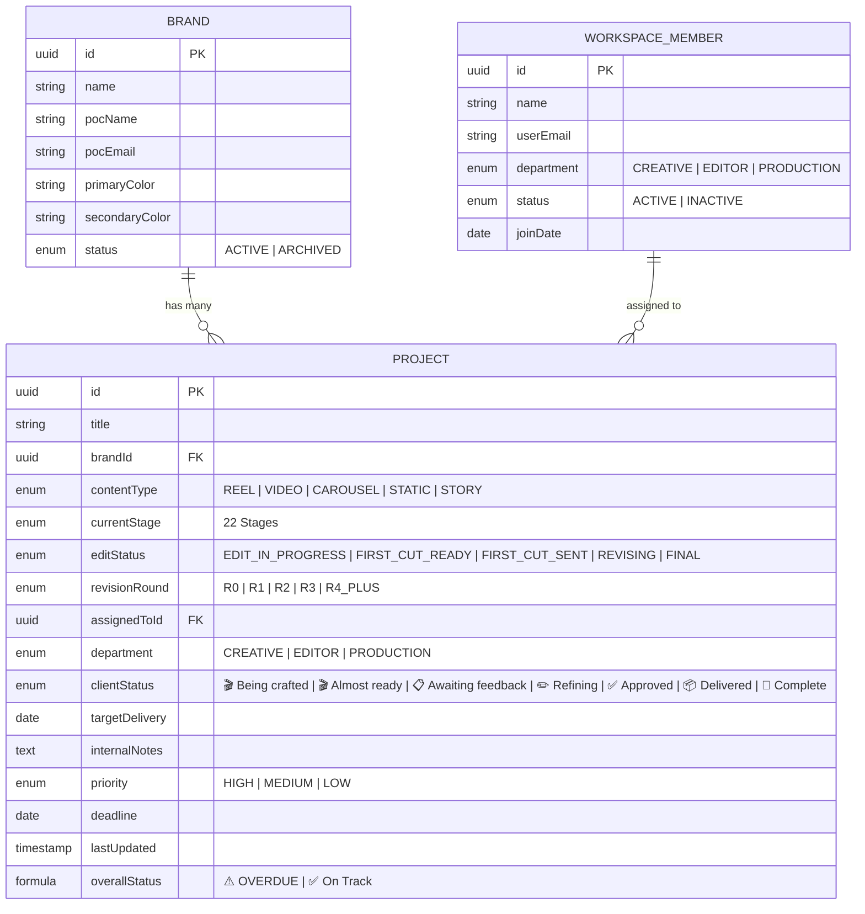
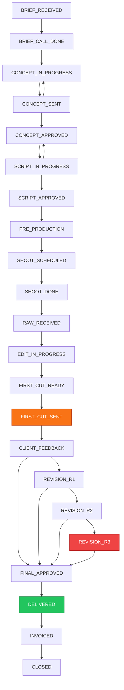

# TBM CRM Architecture & Data Flow

## 1. Relational Data Model

---

## 2. State Machine Pipeline

---

## 3. Workflow Automation Dispatchers

1. **Stage Transition Engine (`Workflow 1`):** Intercepts every `project.updated` event, evaluates transition legality against `VALID_STAGE_TRANSITIONS`, auto-timestamps `lastUpdated = NOW()`, and maps `clientStatus`.
2. **Brand POC First-Cut Notification (`Workflow 2`):** When `currentStage` switches to `FIRST_CUT_SENT`, dispatches `first_cut_ready` email to `brand.pocEmail` with deep-link to client review portal.
3. **Revision Escalation (`Workflow 3`):** Fires upon `revisionRound == R3` to alert Sachin directly (`sachin@theboredmonkey.com`).
4. **Stale Task Cron (`Workflow 4`):** Runs daily at 9:00 AM IST (03:30 UTC), querying non-terminal active projects untouched for >24 hours, notifying assignees and CCing Sachin upon >=3 reminders.
5. **Deadline Alert Cron (`Workflow 5`):** Runs daily at 8:00 AM IST (02:30 UTC), finding deliverables due within 3 days.
6. **Brand Welcome (`Workflow 6`):** Triggers upon `brand.created` to send onboarding and portal credentials.
7. **Team Member Welcome (`Workflow 7`):** Triggers upon `workspaceMember.created` to send department-specific orientation links.
